# QuizProject
 ***Getting last 5 data from wired.com, and creating an exam about selected data.(.net, agilepack, javascript , sqlite***
 
 
 
 
***For Admin Panel password=123456***
 
 
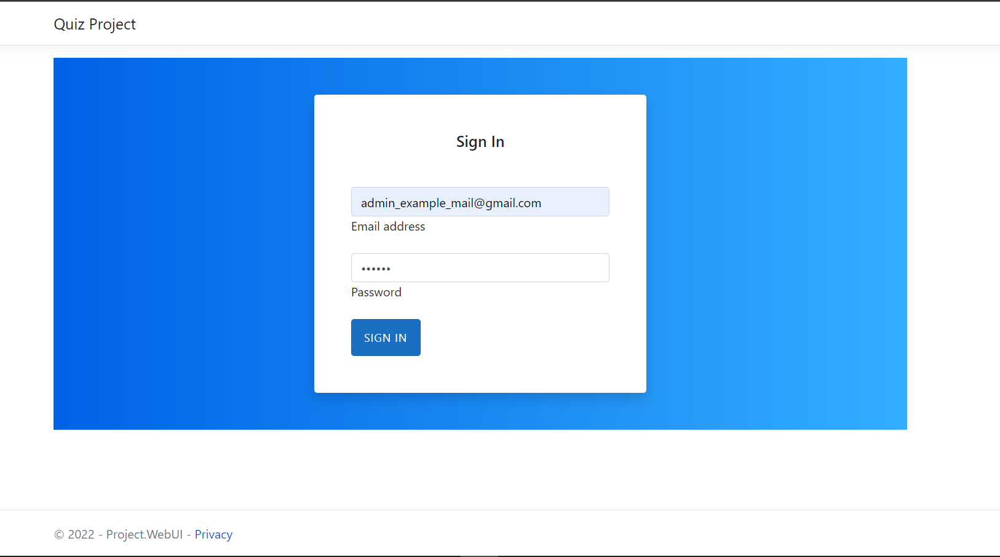
 
 
 
 
**Topics from wired.com (last 5)**
 
 
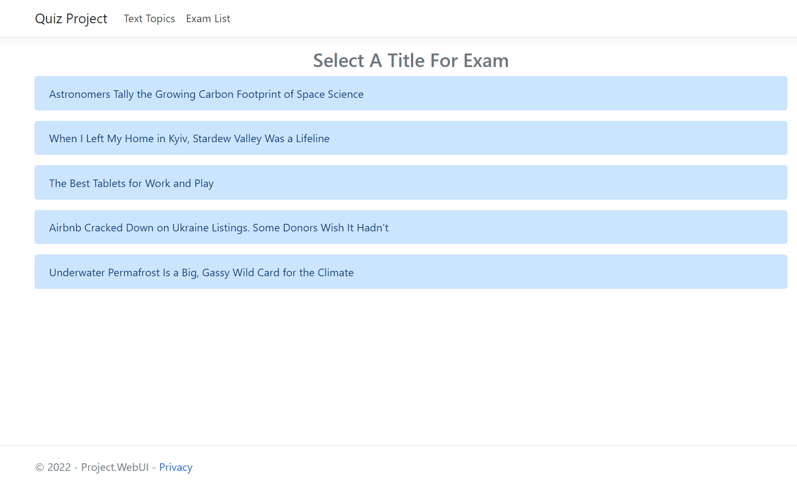
 
 
 
 
**Selected Topic and it's content, you create 4 questions and options about text.**
 
 
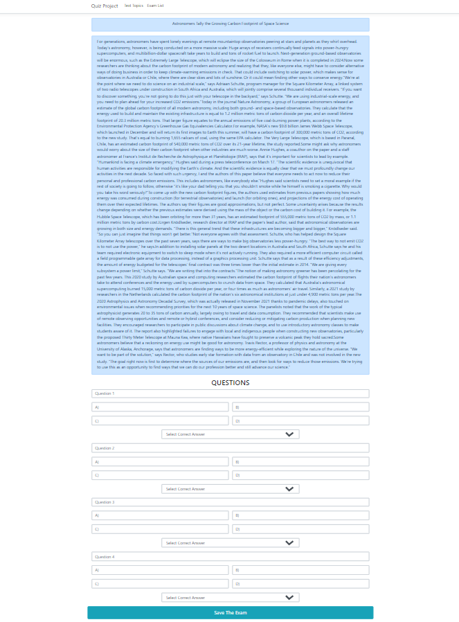
 
 
 
 
**questions,options,correct answer...**
 
 
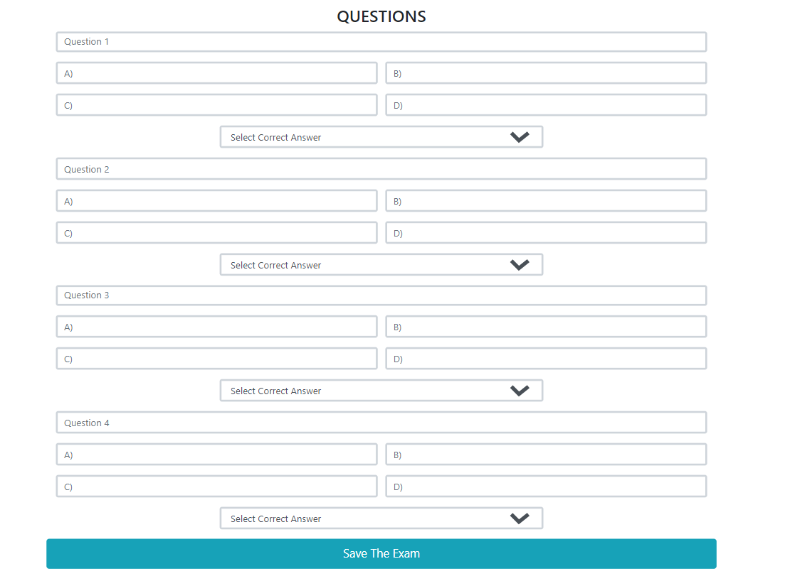
 
 
 
 
**this text getting from wired.com(according to selected topic)**
 
 
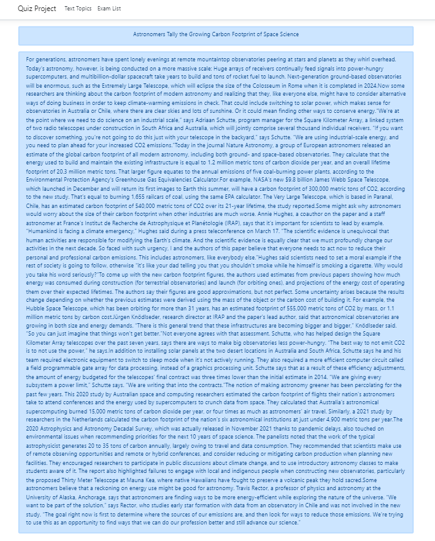
 
 
 
 
**created exam list here. you can an exam assign to user or delete assigned exams.**
 
 
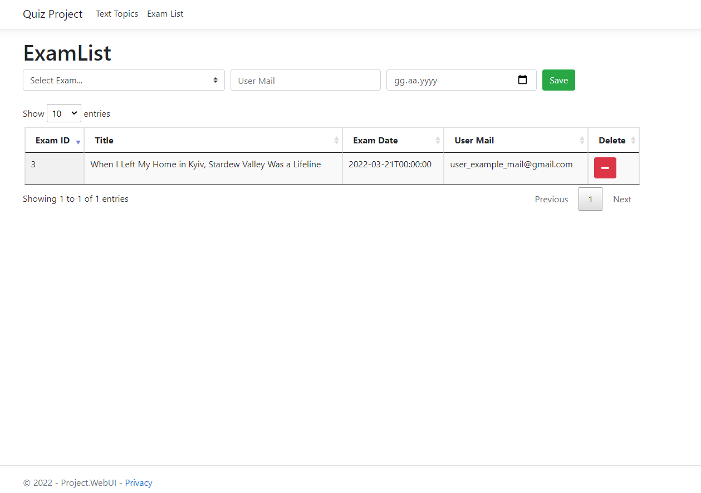
 
 
 
 
**For User Panel password=123456**
 
 
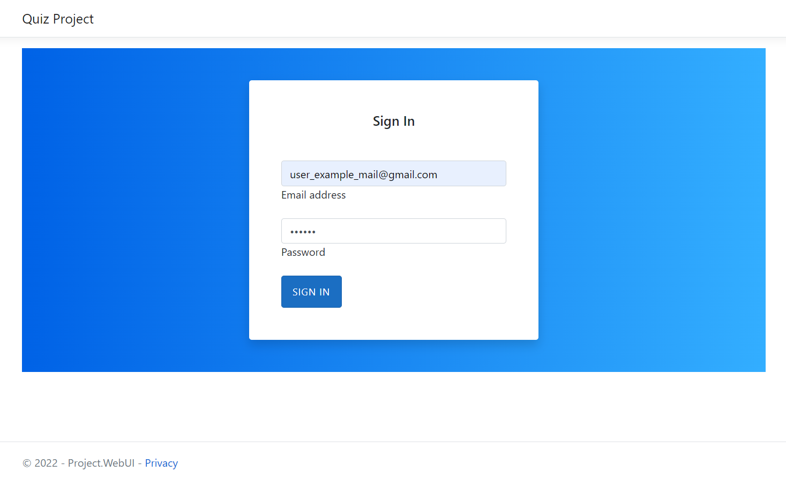
 
 
 
 
**If You taked exam or date is not the exam date(maybe there is not an exam assigned to you):**
 
 
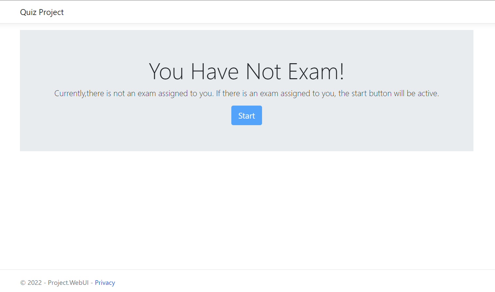
 
 
 
 
**If You have an exam  you can start with button:**
 
 
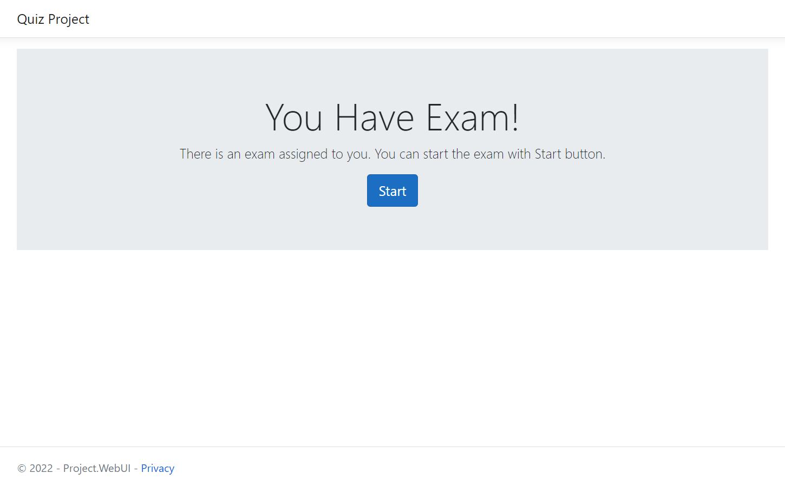
 
 
 
 
**Exams Page looks like this:**
 
 
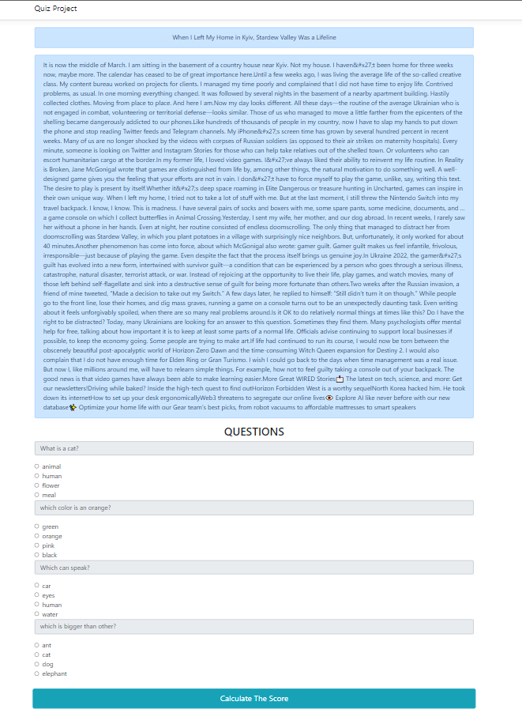
 
 
 
 
**You can select just one option for each question. If you finish click the Calculate button and wait for your score:**
 
 
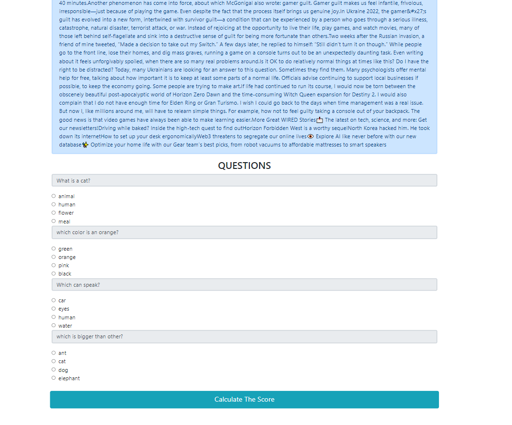
 
 
 
 
**Your score will appear with alert;(one correct queston=25 point). And you will see the All correct options as greened.**
 
 

 
 
