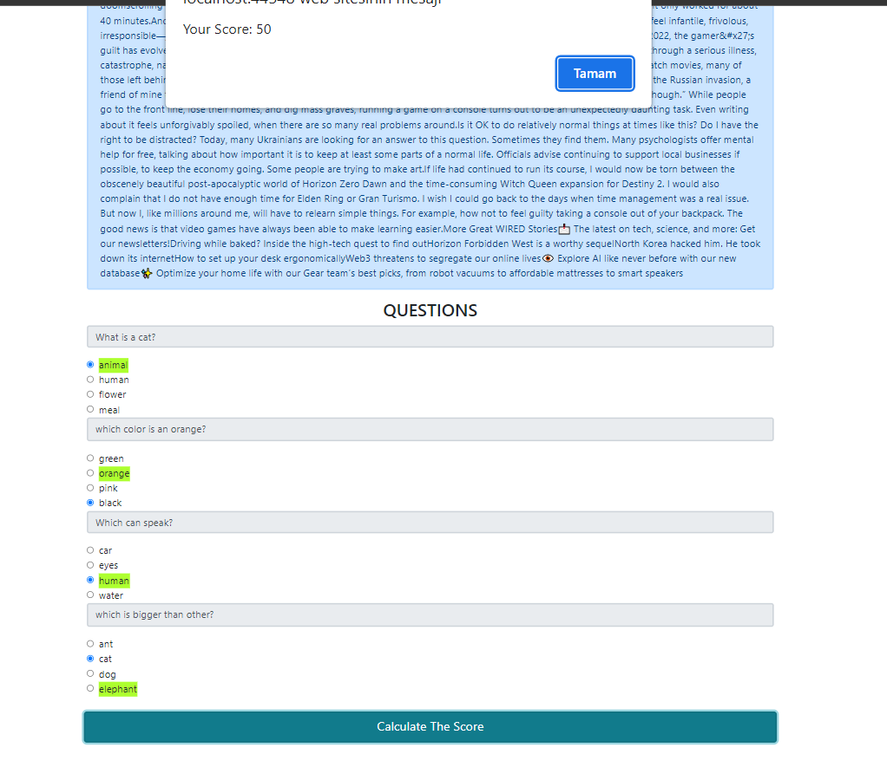

# QuizProject
getting last 5 data from wired.com, and creating an exam about selected data. (.net, agilepack, javascript , sqlite))
 
 

 
 
 
 

 
 
 
 

 
 
 
 

 
 
 
 

 
 
 
 

 
 
 
 

 
 
 
 

 
 
 
 

 
 
 
 

 
 
 
 

 
 
 
 

 
 
